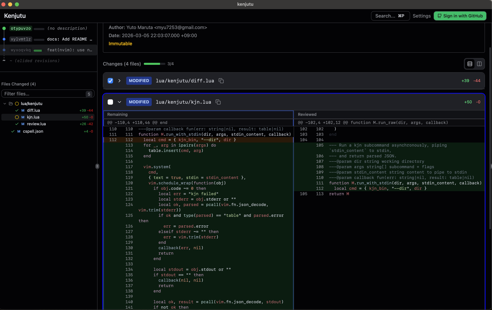
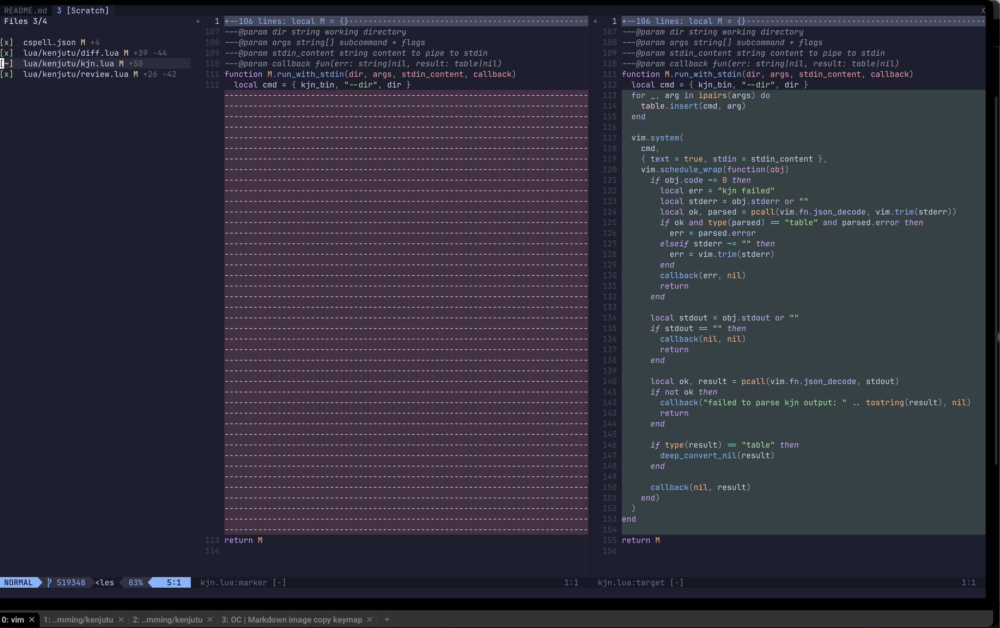

# Kenjutu

**A per-commit code review system for [Jujutsu](https://martinvonz.github.io/jj/) repositories.**

|             desktop app             |         neovim plugin         |
| :---------------------------------: | :---------------------------: |
|  |  |

Kenjutu is a local code review tool for [Jujutsu](https://martinvonz.github.io/jj/)
repositories that use Git as a backend. It lets you review changes commit-by-commit
with hunk-level granularity.

Think of it as having a staging area for every commit — you selectively mark
regions as reviewed, building up your progress hunk by hunk. Review state is
persisted as git objects in your local repository — no database, no external
service. Because review progress is tracked at the content level, it survives
rebases and history rewrites.

> **This is very much a work in progress.** Things will break, features are incomplete,
> and the interface may change significantly. Feedback are welcome!

## Interfaces

Kenjutu is available in four flavors, all sharing the same core engine:

| Interface       | Binary | Description                               | Docs                                       |
| --------------- | ------ | ----------------------------------------- | ------------------------------------------ |
| **Desktop**     | —      | Tauri 2 app with GitHub PR integration    | [docs/desktop.md](docs/desktop.md)         |
| **TUI**         | `kj`   | Terminal UI for reviewing in the terminal | [docs/tui.md](docs/tui.md)                 |
| **Neovim**      | `kjn`  | Neovim plugin for in-editor review        | [docs/nvim-plugin.md](docs/nvim-plugin.md) |
| **Comment CLI** | `kjc`  | Diff comments as JSON for agents/tooling  | [docs/comment-cli.md](docs/comment-cli.md) |

## Key Features

- **Per-commit review** — Review changes one commit at a time, the way they were authored
- **Hunk-level tracking** — Mark individual hunks as reviewed, not just whole files
- **Built for jj** — Designed around jj's commit graph, change IDs, and mutable history (requires git backend)
- **Review state as git objects** — Persistent review progress stored as marker commits in your repo, surviving rebases and history rewrites
- **GitHub PR support** — View and review pull requests locally (desktop app)
- **Inline comments** — Add comments on local commits or read PR comments ported to your changes

## Tech Stack

- **Core**: Rust — git2 for git ops, jj CLI for commit graph and status
- **Desktop**: React 19 + Tauri 2
- **TUI**: Ratatui + Crossterm
- **Neovim**: Lua plugin + Rust CLI backend (`kjn`)

## Getting Started

Each interface has its own installation guide — pick the one that fits your workflow:

- [Desktop App](docs/desktop.md) — Full-featured GUI with GitHub integration
- [Neovim Plugin](docs/nvim-plugin.md) — Stay in your editor
- [TUI](docs/tui.md) — Review from the terminal
- [Comment CLI](docs/comment-cli.md) — Script and automate comment retrieval

All interfaces require [Jujutsu](https://martinvonz.github.io/jj/) (v0.38+) to be installed.

## License

Apache License 2.0 — see [LICENSE](LICENSE) for details.
