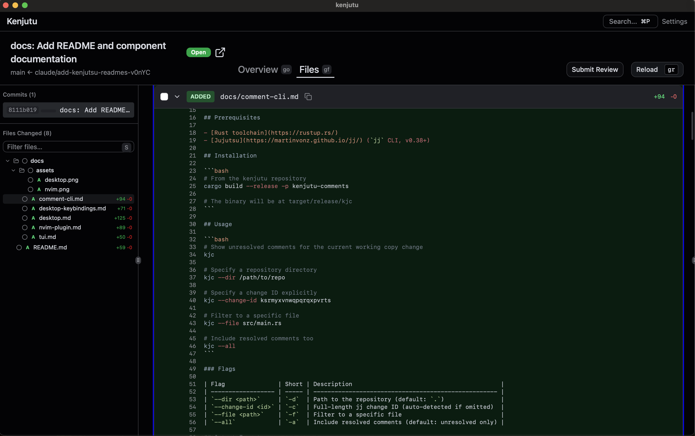
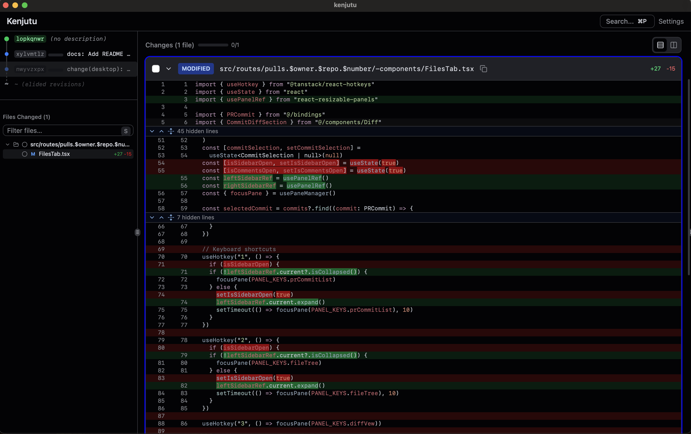
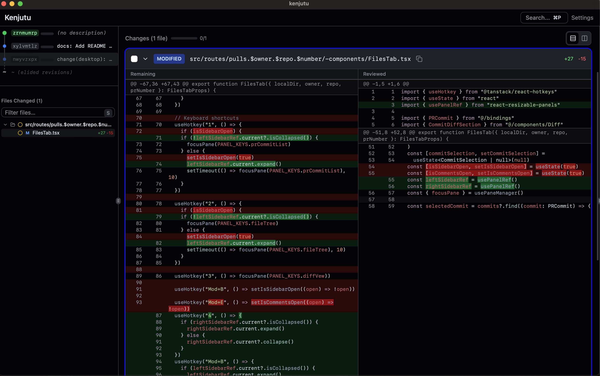

# Kenjutu Desktop

A Tauri 2 desktop application for reviewing diffs and GitHub pull requests locally
in Jujutsu repositories that use a Git backend.

|           local diff           |              github pr               |
| :----------------------------: | :----------------------------------: |
|  |  |

Both views share the same layout — commit list, file tree, and diff viewer
with hunk-level review tracking and rich keyboard navigation.

- **Per-commit review** — Step through commits one at a time
- **Hunk-level review tracking** — Mark individual hunks or line ranges as reviewed
- **Review persistence** — Review state stored as git objects, surviving rebases and history rewrites

### Local Repo View

- **Jujutsu commit graph** — Visual jj log with change IDs and commit descriptions
- **Inline comments** — Add and view comments on local changes

### Pull Request View

- **GitHub PR integration** — Browse and review pull requests from your local clone
- **PR overview** — See PR description, reviewers, and CI checks
- **Review comments sidebar** — View and navigate GitHub review comments
- **Submit reviews** — Submit GitHub reviews directly from the app

## Keyboard Shortcuts

See [Keyboard Shortcuts](desktop-keybindings.md) for the full reference.

## How Review Tracking Works

Each file's diff is split into two panels: **Remaining** and **Reviewed**.

- **Remaining** shows the parts of the diff you haven't reviewed yet.
- **Reviewed** shows the parts you've already marked as reviewed.

When you first open a file, only the Remaining panel is visible since nothing
has been reviewed yet. As you mark regions, the Reviewed panel appears and
hunks move between the two panels.

|                        Before marking                        |                       After marking                        |
| :----------------------------------------------------------: | :--------------------------------------------------------: |
|  |  |

### Marking regions

There are two levels of granularity:

- **Whole file** — Press `Space` on a file in the file list to mark the entire
  file as reviewed. This moves all hunks to Reviewed at once.
- **Line-level** — Enter line mode (`Enter`), navigate to a hunk, optionally
  select specific lines with `V`, then press `Space` to mark just that region.
  This lets you review a file partially — some hunks reviewed, others still
  remaining.

### Switching panels

Use `Tab` in line mode to switch between the Remaining and Reviewed panels.
This is useful for double-checking what you've already reviewed, or unmarking
a region (press `Space` on a reviewed region to move it back to Remaining).

### File review status

Each file in the file list shows one of these states:

- **Unreviewed** — No regions have been marked
- **Partially reviewed** — Some hunks are reviewed, others remain
- **Reviewed** — All hunks have been marked as reviewed

## Prerequisites

- [Rust toolchain](https://rustup.rs/) (for building the Tauri backend)
- [Node.js](https://nodejs.org/) (v18+)
- [pnpm](https://pnpm.io/)
- [Jujutsu](https://martinvonz.github.io/jj/) (`jj` CLI, v0.38+)
- System dependencies for Tauri — see the [Tauri prerequisites guide](https://v2.tauri.app/start/prerequisites/)

## Getting Started

```bash
# Clone the repository
git clone https://github.com/Yuki-bun/kenjutu.git
cd kenjutu

# Install frontend dependencies
pnpm install

# Run in development mode
pnpm tauri dev

# Build for production
pnpm tauri build
```

## Development

```bash
# Type checking (frontend)
pnpm check

# Generate TypeScript bindings for Tauri commands
pnpm gen

# Format & lint
pnpm fmt
pnpm lint
```
