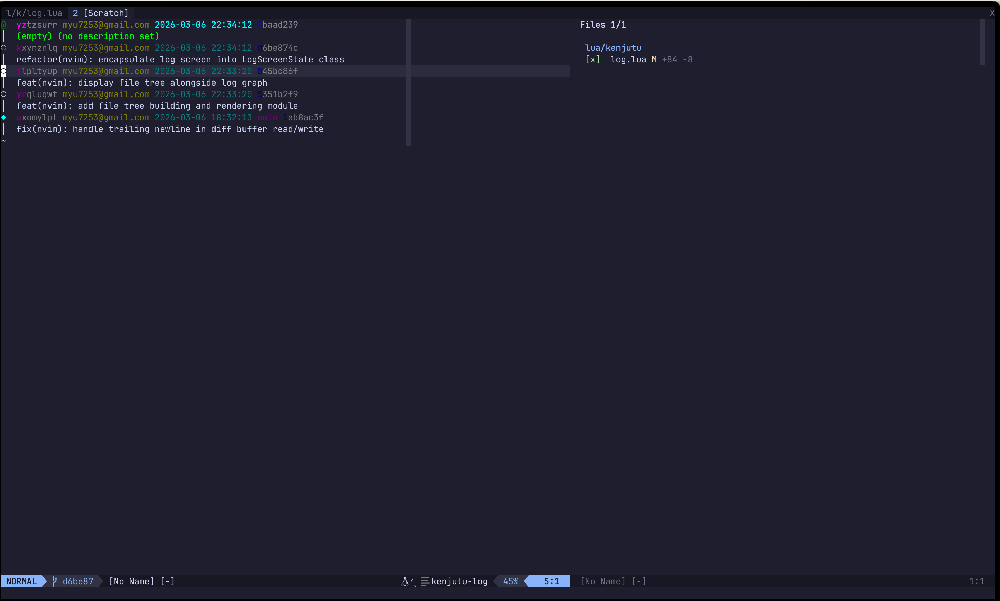
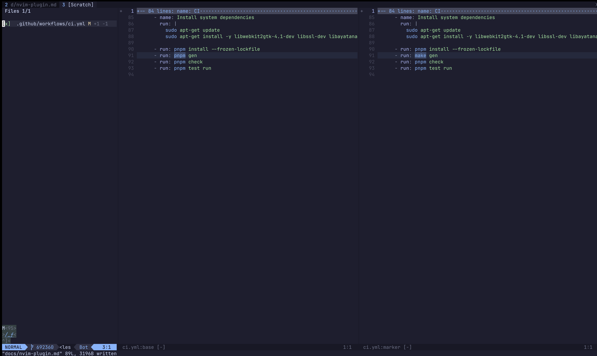

# Kenjutu Neovim Plugin

A Neovim plugin for browsing jj commit logs and reviewing diffs in Jujutsu
repositories — with hunk-level review tracking, all without leaving your editor.

|          log view           |           diff view           |
| :-------------------------: | :---------------------------: |
|  |  |

## Features

- **`:Kenjutu log`** — Browse your jj commit graph with colored output
- **Split diff views** — Side-by-side base, marker, and target views using native Vim diff
- **Hunk-level review** — Mark hunks as reviewed with `s` (uses `diffput`/`diffget` under the hood)
- **File list** — Navigate changed files and toggle their review status
- **Review persistence** — Review state is saved as git objects via marker commits and survives rebases

## Prerequisites

- [Neovim](https://neovim.io/) (0.11+)
- [Jujutsu](https://martinvonz.github.io/jj/) (`jj` CLI, v0.38+)
- [Rust toolchain](https://rustup.rs/) (for building the `kjn` backend binary)

## Installation

### lazy.nvim

```lua
{
  "Yuki-bun/kenjutu",
  build = "make build-kjn",
}
```

The `build` step compiles the `kjn` binary into `target/release/kjn`. The plugin
automatically uses this vendored binary from the plugin directory — no PATH setup needed.

## Usage

### Commands

```
:Kenjutu log    " Open the jj commit log
```

### Keybindings

#### Log Screen

| Key    | Action                                 |
| ------ | -------------------------------------- |
| `j`    | Move to next commit                    |
| `k`    | Move to previous commit                |
| `<CR>` | Open review screen for selected commit |
| `r`    | Refresh the commit log                 |
| `q`    | Close the log screen                   |

#### Review — File List (left pane)

| Key       | Action                                  |
| --------- | --------------------------------------- |
| `j`       | Move selection down                     |
| `k`       | Move selection up                       |
| `<CR>`    | Focus to the diff pane                  |
| `<Space>` | Toggle file reviewed/unreviewed         |
| `r`       | Refresh the file list                   |
| `t`       | Toggle diff mode (remaining ↔ reviewed) |
| `q`       | Close the review screen                 |

#### Review — Diff Pane (right pane)

| Key     | Action                                        |
| ------- | --------------------------------------------- |
| `s`     | Mark hunk as reviewed (normal mode)           |
| `s`     | Mark selected lines as reviewed (visual mode) |
| `<Tab>` | Focus back to file list                       |
| `gj`    | Jump to next file                             |
| `gk`    | Jump to previous file                         |
| `t`     | Toggle diff mode (remaining ↔ reviewed)       |
| `q`     | Close the review screen                       |

## Architecture

The plugin has two parts:

**Lua plugin** (`/lua/kenjutu`) — Handles the UI: rendering the commit graph, managing
diff windows, tracking keybindings, and displaying review state.

**Rust CLI backend** (`/src-nvim`, binary `kjn`) — Does the heavy lifting: reading git
objects, computing diffs, resolving file trees, and managing marker commits. The Lua
plugin calls `kjn` as a subprocess and parses its JSON output.
