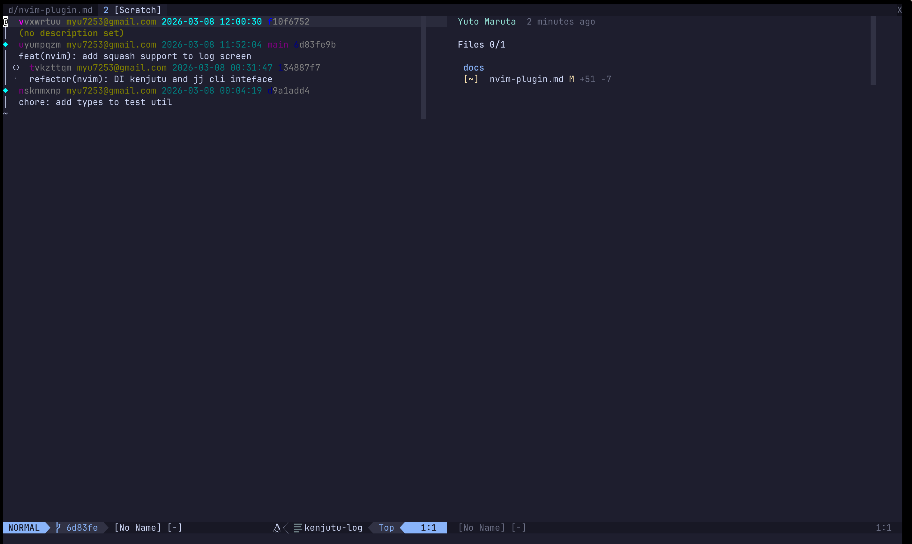
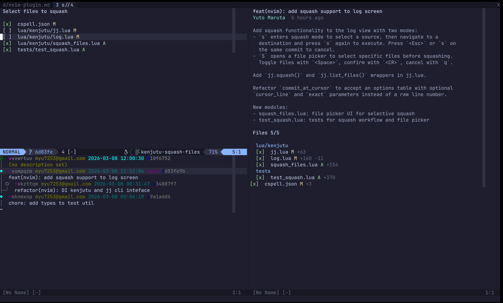

# Kenjutu Neovim Plugin

<video src="https://github.com/user-attachments/assets/e6c8ae3e-aad4-48f0-ba23-6d0be6c381a8" autoplay loop muted playsinline></video>

A Neovim plugin for browsing jj commit logs and reviewing diffs in Jujutsu
repositories — with hunk-level review tracking, all without leaving your editor.

|          log view           |           diff view           |
| :-------------------------: | :---------------------------: |
|  |  |

## Features

- **`:Kenjutu log`** — Browse your jj commit graph with colored output
- **Split diff views** — Side-by-side base, marker, and target views using native Vim diff
- **Hunk-level review** — Mark hunks as reviewed with `s` (uses `diffput`/`diffget` under the hood)
- **File list** — Navigate changed files and toggle their review status
- **Review persistence** — Review state is saved as git objects via marker commits and survives rebases
- **Squash** — Move changes between commits directly from the log screen, with optional file selection

## Prerequisites

- [Neovim](https://neovim.io/) (0.11+)
- [Jujutsu](https://martinvonz.github.io/jj/) (`jj` CLI, v0.38+)

## Installation

### lazy.nvim (prebuilt binary)

```lua
{
  "Yuki-bun/kenjutu",
  build = "make install-kjn",
}
```

This downloads a prebuilt `kjn` binary for your platform from GitHub releases
with SHA-256 checksum verification. No Rust toolchain required. Prebuilt binaries
are available for Linux (x86_64, aarch64) and macOS (Apple Silicon). Intel Mac
users should build from source.

### lazy.nvim (build from source)

```lua
{
  "Yuki-bun/kenjutu",
  build = "make build-kjn",
}
```

Requires a [Rust toolchain](https://rustup.rs/). Compiles the `kjn` binary from source.

### Manual installation

```bash
# Prebuilt binary
make install-kjn

# Or build from source
make build-kjn
```

The plugin automatically locates the `kjn` binary from the plugin directory — no
PATH setup needed. It checks `bin/kjn` (prebuilt) first, then `target/release/kjn`
(source build).

## Usage

### Commands

```
:Kenjutu log    " Open the jj commit log
```

### Keybindings

#### Log Screen

| Key     | Action                                 |
| ------- | -------------------------------------- |
| `j`     | Move to next commit                    |
| `k`     | Move to previous commit                |
| `<CR>`  | Open review screen for selected commit |
| `d`     | Edit commit description                |
| `s`     | Start squash (or confirm destination)  |
| `S`     | Squash with file picker                |
| `<Esc>` | Cancel squash mode                     |
| `r`     | Refresh the commit log                 |
| `q`     | Close the log screen                   |

#### Review — File List (left pane)

| Key       | Action                                  |
| --------- | --------------------------------------- |
| `j`       | Move selection down                     |
| `k`       | Move selection up                       |
| `<CR>`    | Focus to the diff pane                  |
| `<Space>` | Toggle file reviewed/unreviewed         |
| `r`       | Refresh the file list                   |
| `t`       | Toggle diff mode (remaining ↔ reviewed) |
| `q`       | Close the review screen                 |

#### Review — Diff Pane (right pane)

| Key     | Action                                        |
| ------- | --------------------------------------------- |
| `s`     | Mark hunk as reviewed (normal mode)           |
| `s`     | Mark selected lines as reviewed (visual mode) |
| `<Tab>` | Focus back to file list                       |
| `gj`    | Jump to next file                             |
| `gk`    | Jump to previous file                         |
| `t`     | Toggle diff mode (remaining ↔ reviewed)       |
| `q`     | Close the review screen                       |

### Squash

Squash lets you move changes from one commit into another without leaving the
log screen. There are two modes: full squash and selective (file picker) squash.

#### Full squash

1. Navigate to the source commit and press `s` to enter squash mode. The source
   line is highlighted.
2. Navigate to the destination commit and press `s` again to execute.
3. Press `<Esc>` or `s` on the same source commit to cancel.



#### Selective squash (file picker)

1. Navigate to the source commit and press `S`. A file picker opens above the
   log showing all changed files in that commit.
2. Toggle individual files with `<Space>`. All files start selected.
3. Press `<CR>` to confirm your selection and enter squash destination mode.
   Press `q` or `<Esc>` to cancel.
4. Navigate to the destination commit and press `s` to execute.

Only the selected files are moved to the destination.



#### File picker keybindings

| Key         | Action             |
| ----------- | ------------------ |
| `<Space>`   | Toggle file on/off |
| `<CR>`      | Confirm selection  |
| `q`/`<Esc>` | Cancel file picker |

## Architecture

The plugin has two parts:

**Lua plugin** (`/lua/kenjutu`) — Handles the UI: rendering the commit graph, managing
diff windows, tracking keybindings, and displaying review state.

**Rust CLI backend** (`/src-nvim`, binary `kjn`) — Does the heavy lifting: reading git
objects, computing diffs, resolving file trees, and managing marker commits. The Lua
plugin calls `kjn` as a subprocess and parses its JSON output.
