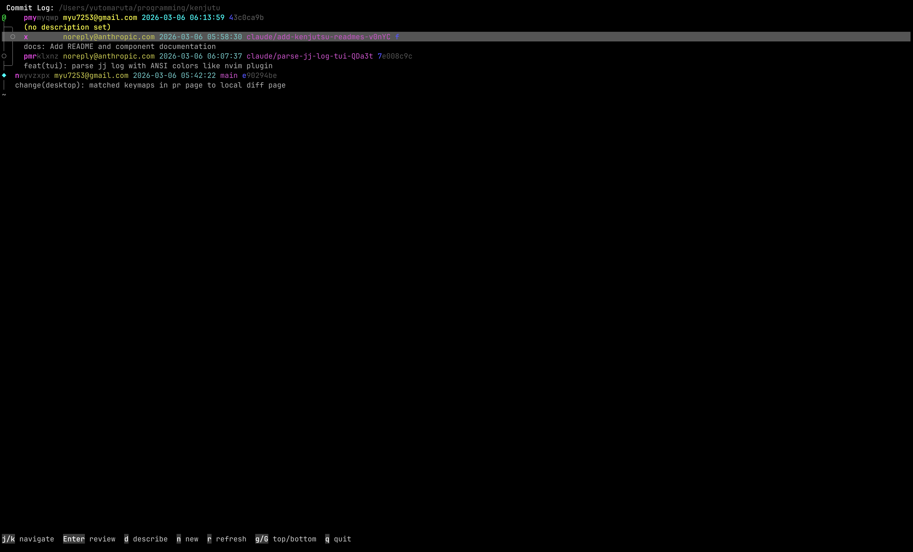
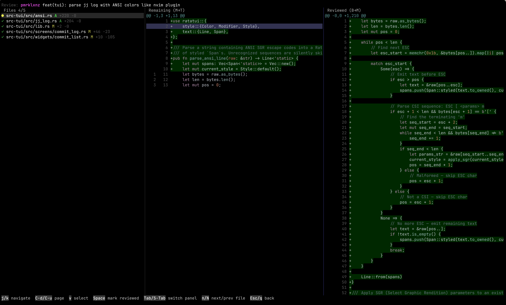

# Kenjutu TUI

A terminal UI for per-commit code review in Jujutsu repositories (git backend),
built with [Ratatui](https://ratatui.rs/).

|          log view          |          diff view           |
| :------------------------: | :--------------------------: |
|  |  |

## Current Features

- **Commit log screen** — Scrollable jj commit graph with inline describe and `jj new`
- **Review screen** — Split-pane file list + syntax-highlighted diff viewer
- **Hunk-level review tracking** — Mark individual hunks as reviewed
- **Review persistence** — State saved as marker commits (git objects), survives rebases

## Prerequisites

- [Rust toolchain](https://rustup.rs/)
- [Jujutsu](https://martinvonz.github.io/jj/) (`jj` CLI, v0.38+)

## Installation

```bash
# From the kenjutu repository
cargo build --release -p kenjutu-tui

# The binary will be at target/release/kj
```

## Usage

```bash
# Open TUI in the current directory
kj

# Open TUI for a specific repository
kj --dir /path/to/repo
```

The repository must be a jj repository (colocated with git).
